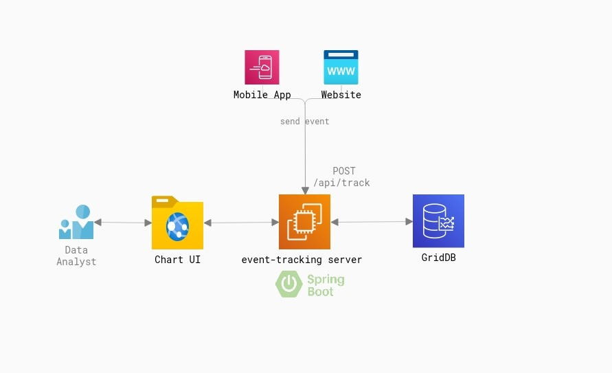
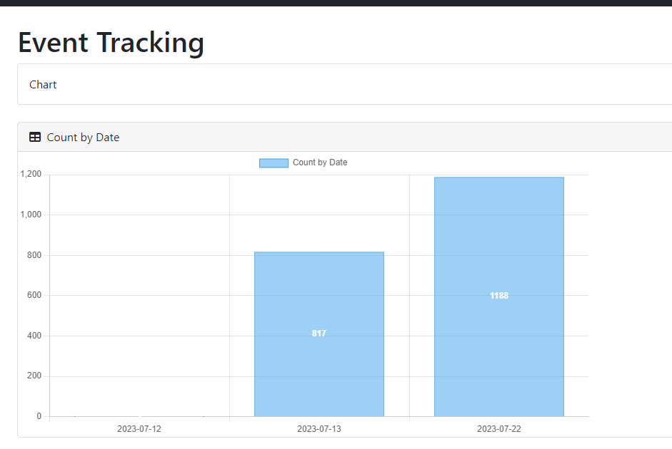
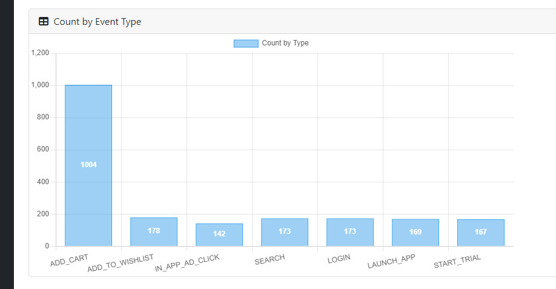

Realtime Event Tracking using Spring Boot and GridDB
===



## Definition of Event Tracking Service

In today's digital landscape, tracking and analyzing user events is crucial for gaining insights into user behavior, optimizing performance, and delivering a personalized user experience.

An event is any interaction occurring on a website or mobile app that is triggered by a user's action. This includes a whole bunch of things from clicking a button to signing up for a newsletter to buying a product. Event page views themselves are events.

An Event Tracking Service allows organizations to capture and process events as they happen, providing businesses with up-to-the-minute insights. This allows businesses to react swiftly to emerging trends, identify issues in real time, and make data-driven decisions on the fly.

This article will explore how to implement a Realtime Event Tracking Service using Spring Boot and GridDB.


## Functional Requirements

Before diving into the technical details, let's outline the key functional requirements of our Event Tracking Service. These requirements will shape the design and implementation of our system.


* Capture and store events in real time.
* Provide a dashboard with aggregated data.


## Estimating Capacity

Let's find out how much data we need to process every day.

Suppose, we have 10K daily active users.
* Each user has 50 clicks per day
* 10K * 50 = 500K clicks per day
* One-click data is 0.1KB

*Daily storage needed: 0.1KB * 500K = 50 megabytes per day*


### Choosing the Right Database: SQL or NoSQL

When it comes to databases, the choice between SQL and NoSQL depends on the specific requirements of your application. For our Realtime Event Tracking Service, where speed and scalability are crucial, NoSQL architecture outshines traditional SQL databases.

NoSQL databases like GridDB provide flexible schema design, horizontal scalability, and optimized performance for handling high-volume, real-time event data. They offer fast data ingestion and retrieval, making them ideal for event tracking and analytics use cases.


## Setting up a Java Application using Spring Boot

Before diving into the implementation details in Spring Boot, it's important to have a basic understanding of the Spring Boot framework. Spring Boot is a popular Java-based framework that simplifies the development of standalone, production-grade Spring-based applications. It provides a comprehensive set of tools and libraries that streamline the development process, allowing developers to focus on writing business logic rather than dealing with boilerplate code.

Now let's proceed with setting up a Java application using Spring Boot.

* Install Java Development Kit (JDK) and set up your development environment.
* Set up a new Spring Boot project using your preferred build tool (e.g., Maven or Gradle).
We will use https://start.spring.io/ to initialize a Spring Boot project.
* Configure Spring Boot dependencies for GridDB and other required libraries.
The main library in this project are :
 1. **spring-boot-starter-web**: Starter for building web, including RESTful, applications using Spring MVC. Uses Tomcat as the default embedded container
 
    ```
    <dependency>
        <groupId>org.springframework.boot</groupId>
        <artifactId>spring-boot-starter-web</artifactId>
    </dependency>
    ```
 2. **gridstore** Java Client for GridDB CE

    ```
    <dependency>
        <groupId>com.github.griddb</groupId>
        <artifactId>gridstore</artifactId>
        <version>5.1.0</version>
    </dependency>
    ```


### Define GridDB configurations
Before creating the API endpoint, we need to acquire a connection between the application and the cluster database of GridDB. Here we create an instance of GridStore class.
```java
@Bean
public GridStore gridStore() throws GSException {
    // Acquiring a GridStore instance
    Properties properties = new Properties();
    properties.setProperty("notificationMember", "griddbserver:10001");
    properties.setProperty("clusterName", "dockerGridDB");
    properties.setProperty("user", "admin");
    properties.setProperty("password", "admin");
    GridStore store = GridStoreFactory.getInstance().getGridStore(properties);
    return store;
}
```

### Implement event data models
This is our Java class that will hold the event data. We set the timestamp column as the primary key.
```java
import java.util.Date;
import com.toshiba.mwcloud.gs.RowKey;
import lombok.Data;

@Data
public class Event {
    @RowKey
    Date timestamp;
    String appId;
    String eventType;
    String externalId;
}
```
* appId: Owner ID of the Mobile App or Website.
* eventType: "ADD_CART", "ADD_TO_WISHLIST", "IN_APP_AD_CLICK", "SEARCH", "LOGIN", "LAUNCH_APP", "START_TRIAL"
* externalId: External userId

### Create a Container for managing the rows
After setting up the DB connection, we can use it to create the container. We are using the TimeSeries container to store a series of events because we need to manage rows with the occurrence time.

```java
import com.toshiba.mwcloud.gs.TimeSeries;

@Bean
public TimeSeries<Event> eventsContainer(GridStore gridStore) throws GSException {
    return gridStore.putTimeSeries("events", Event.class);
}
```

* com.toshiba.mwcloud.gs.TimeSeries interface is A specialized Container with a time-type Row key for TimeSeries data operation.

## Capturing events.

We need to create RESTful endpoints for capturing events. In this tutorial, we only provide one endpoint.

To report an event (e.g. **LaunchAPP, Purchase, Login, Add to Cart**), make a POST request through the /app/track/ endpoint.


| Request address | http://localhost:8080/api/track |
| -------- | -------- |
| Request method     | **POST**     |

Request Example
```bash
curl --request POST --url http://localhost:8080/api/track \
 --header 'content-type: application/json'  --header 'user-agent: vscode-restclient' \
   --data '{
    "appId":"APP_1",
    "eventType":"ADD_CART",
    "externalId":"2385254254",
    "timestamp":"2023-07-12T10:55:50.764Z"
}'
```

Response Example
```
HTTPS/1.1 200 OK
Saved

```
* This endpoint will return an HTPP Status 200 on success, or throw an exception in case an error occurred.


### Implement event processing and storage logic using GridDB's Java client libraries

To save the event data, first, we need to acquire the Container created earlier, then call the append method.

```java
public void create(EventRequest request) {
    Event event = new Event();
    event.setAppId(request.getAppId());
    event.setEventType(request.getEventType());
    event.setExternalId(request.getExternalId());
    event.setTimestamp(request.getTimestamp());
    try {
        eventsContainer.append(event);
    } catch (GSException e) {
        e.printStackTrace();
    }
}
```

## Reporting Web Interface

Now we need to provide real-time dashboards. In this tutorial, we will create two charts to display the count of events by date and by event type.

### Create chart
We use Chartjs to display the chart on top of the Thymeleaf template.

Chart.js provides a set of frequently used chart types, plugins, and customization options. In addition to a reasonable set of built-in chart types, you can use additional community-maintained chart types. On top of that, it’s possible to combine several chart types into a mixed chart (essentially, blending multiple chart types into one on the same canvas).

#### We create a bar chart for a single dataset and render it on an HTML page.

```javascript
<script th:inline="javascript">
    Chart.register(ChartDataLabels);
    const ctx = document.getElementById('charts');

    const data = /*[[${aggregates}]]*/[
        { timeLabel: "2023-07-01", count: 10 }
    ];

    new Chart(ctx, {
        type: 'bar',
        data: {
            labels: data.map(row => row.timeLabel),
            datasets: [{
                label: 'Count by Date',
                data: data.map(row => row.count),
                borderWidth: 1
            }]
        },
        options: {
            scales: {
                y: {
                    beginAtZero: true
                }
            },
            plugins: {
                datalabels: {
                    color: 'white',
                    font: {
                        weight: 'bold'
                    }
                }
            }
        }
    });
```

#### Showing the count of events by date


#### Showing the count of events by event type



### Event aggregation
To provide the dataset into the chartjs, we need to use aggregate operation on the timeseries rows.

```java
public List<EventAggregateView> getEvents() {
        List<EventAggregateView> views = new ArrayList<>();

        LocalDateTime startDate = LocalDateTime.parse("2023-07-01T00:00:00"),
                endDate = LocalDateTime.now();
        for (LocalDateTime date = startDate; date.isBefore(endDate); date = date.plusDays(1)) {
            try {
                java.util.Date start =
                        convertToDateViaInstant(date.withHour(0).withMinute(0).withSecond(0));
                java.util.Date end =
                        convertToDateViaInstant(date.withHour(23).withMinute(59).withSecond(59));
                AggregationResult aggregationResult =
                        eventsContainer.aggregate(start, end, "appId", Aggregation.COUNT);
                Long count = aggregationResult.getLong();
                if (count.compareTo(0L) > 0) {
                    views.add(new EventAggregateView(convertToDateViaInstant(date), count,
                            date.format(dateTimeFormatter)));
                }
            } catch (GSException e) {
                e.printStackTrace();
            }
        }
        return views;
    }
```

We use the aggregate function from the TimeSeries container.
 
```
AggregationResult aggregate(java.util.Date start,
                          java.util.Date end,
                          java.lang.String column,
                          Aggregation aggregation)
                            throws GSException
```

> Performs an aggregation operation on a Row set or its specific Columns, based on the specified start and end times.
The parameter column might be ignored depending on the parameter aggregation. The boundary Rows whose timestamps are identical with the start or end time are included in the range of operation. If the specified start time is later than the end time, all Rows are excluded from the range.


## Best Practices
To make the most out of real-time event tracking in Spring Boot, it's important to follow some best practices. Here are some recommendations to help you leverage the full potential of real-time event tracking:

* Spend time defining a clear and consistent event schema that captures all the relevant user actions and interactions. It's also important to capture relevant contextual information that provides insights into the user's state and environment.
* Ensure the system complies with data protection regulations and implement appropriate security measures.
* Implement analytics pipelines by using a stream processing engine.
* Decoupling event producer and consumer by using a combination of event-driven architectures and messaging technologies such as Apache Kafka or RabbitMQ.
